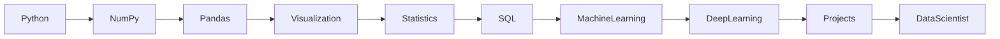

# Data Science Journey 2026

Roadmap

---
## Learning Stack

🐍 Python • 📊 Pandas • 🔢 NumPy • 📈 Matplotlib • 📉 Seaborn

🗄️ SQL • 🤖 Scikit-Learn • 🧠 TensorFlow • 🔥 PyTorch

🌿 Git • 📂 GitHub • 💻 VS Code • 🐳 Docker

---

## 💀 60 DAY CHALLENGE

### Learn → Build → Deploy

